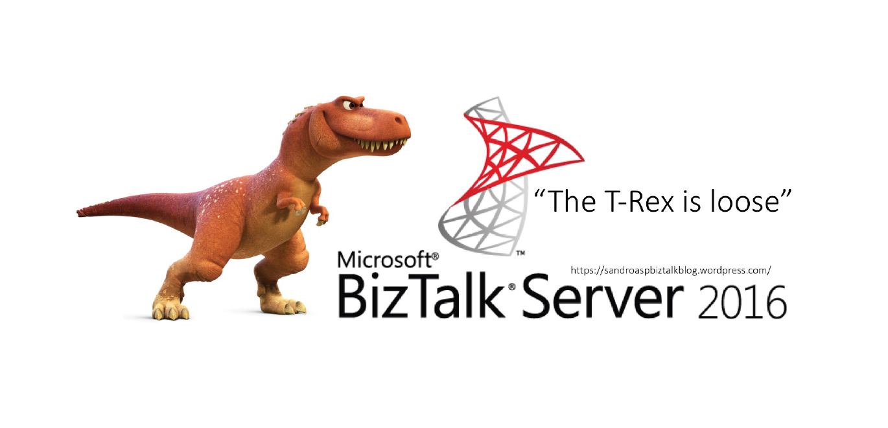
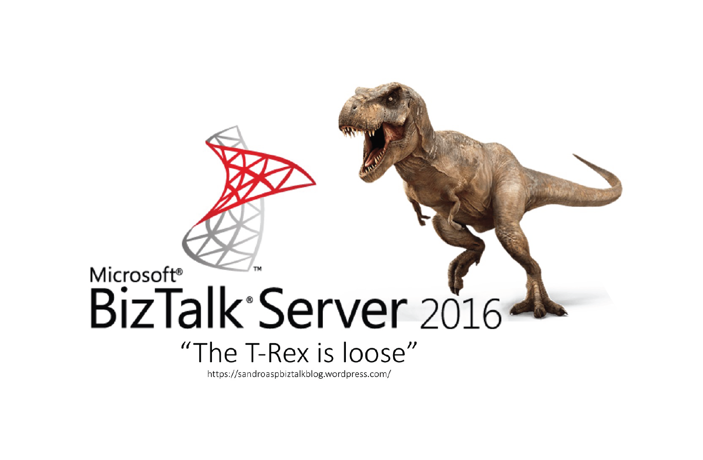

# BizTalk Server 2016 Stickers
I always felt a little "jealousy", maybe not the best word to describe, probably: “sad”, “eager to have or find”, some kind of merchandise related to the technology "I love": BizTalk Server:
* a bag, a shirt, jacket or a simple sticker
* Although there are, they are rare to find, believe me!

And in an epoch or popular trend that what you will find more is stickers to put in your laptop from Azure, Gulp, Visual Studio and more recently Microsoft Flow, PowerApps, Hololens, API and many more stickers... you will not find any BizTalk Server stickers!

... well until now!

"T-Rex is loose"... once again
There are the "dear"/"sweet" T-Rex version:

And  the infamous badass T-Rex version:

# About Me
**Sandro Pereira** | [DevScope](http://www.devscope.net/) | MVP & MCTS BizTalk Server 2010 | [https://blog.sandro-pereira.com/](https://blog.sandro-pereira.com/) | [@sandro_asp](https://twitter.com/sandro_asp)